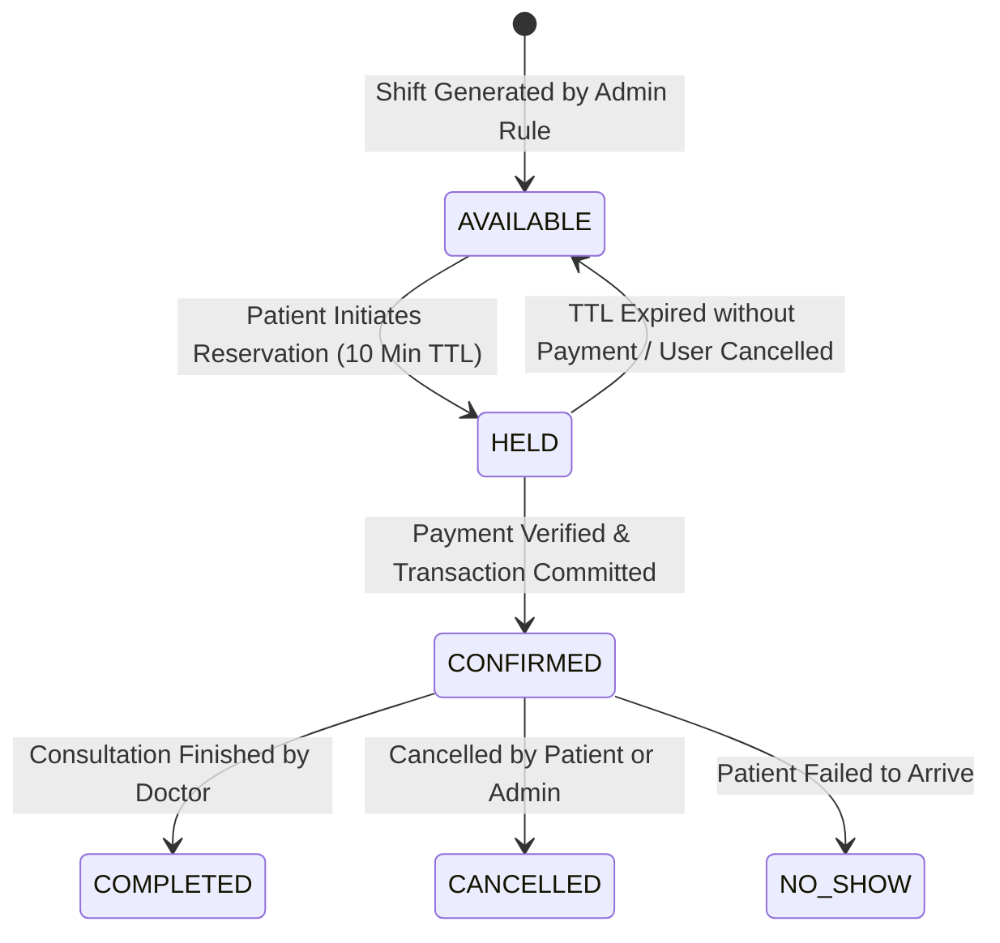

# Architecture Specification: Slot Booking Concurrency & State Machine

**Entity:** Sanjeevani Multispeciality Hospital Platform  
**Component:** Slot Concurrency & Reservation Engine  
**Critical Challenge:** Preventing race conditions and double-booking when multiple patients attempt to book the exact same doctor time slot simultaneously.

---

## 1. Slot Lifecycle State Machine



---

## 2. Concurrency Guarantee Mechanisms

### 1. Database-Level Unique Constraint
The database enforces a composite unique constraint preventing two active (non-cancelled) appointments for the same doctor at the same moment:
```sql
CREATE UNIQUE INDEX idx_unique_active_doctor_slot 
ON appointments (doctor_id, appointment_date, start_time) 
WHERE status NOT IN ('CANCELLED');
```

### 2. Pessimistic Row Locking (`FOR UPDATE`) inside Prisma Transactions
When reserving a slot:
```typescript
await prisma.$transaction(async (tx) => {
  // Lock the specific slot row to prevent concurrent reading
  const slot = await tx.$queryRaw`
    SELECT * FROM appointment_slots 
    WHERE id = ${slotId} AND status = 'AVAILABLE' 
    FOR UPDATE
  `;

  if (!slot || slot.length === 0) {
    throw new SlotUnavailableException('This slot is already reserved or held.');
  }

  // Atomically update slot to HELD with 10-minute expiry
  await tx.appointmentSlot.update({
    where: { id: slotId },
    data: {
      status: 'HELD',
      heldUntil: new Date(Date.now() + 10 * 60 * 1000),
      bookingSessionId: sessionId,
    },
  });
});
```

---

## 3. Handling Payment-First Desired Flow & Recovery

Since the platform architecture verifies payment before final slot allocation:
1. **Pending Booking Session Created**: Upon OTP verification and patient details entry, a `BookingSession` is created in state `PENDING_PAYMENT`.
2. **Razorpay Order Created**: Tied to `BookingSession.id` and consultation fee.
3. **Payment Cryptographic Signature Verified**: Webhook / Return API marks `BookingSession` as `PAYMENT_VERIFIED`.
4. **Slot Selection & Atomic Confirmation**: Patient chooses available slot from real-time live availability. Backend locks and transitions slot to `CONFIRMED`.
5. **Fail-Safe Recovery Protocol**: In the rare event that all remaining slots for that day fill up before the patient selects a time, the session is marked `RECOVERY_PENDING`. The patient is immediately provided options:
   - Reschedule for the next available date with zero additional charge.
   - 1-click automated Razorpay refund initiated via the backend refund API.
   - Dedicated front-desk priority helpline contact.
